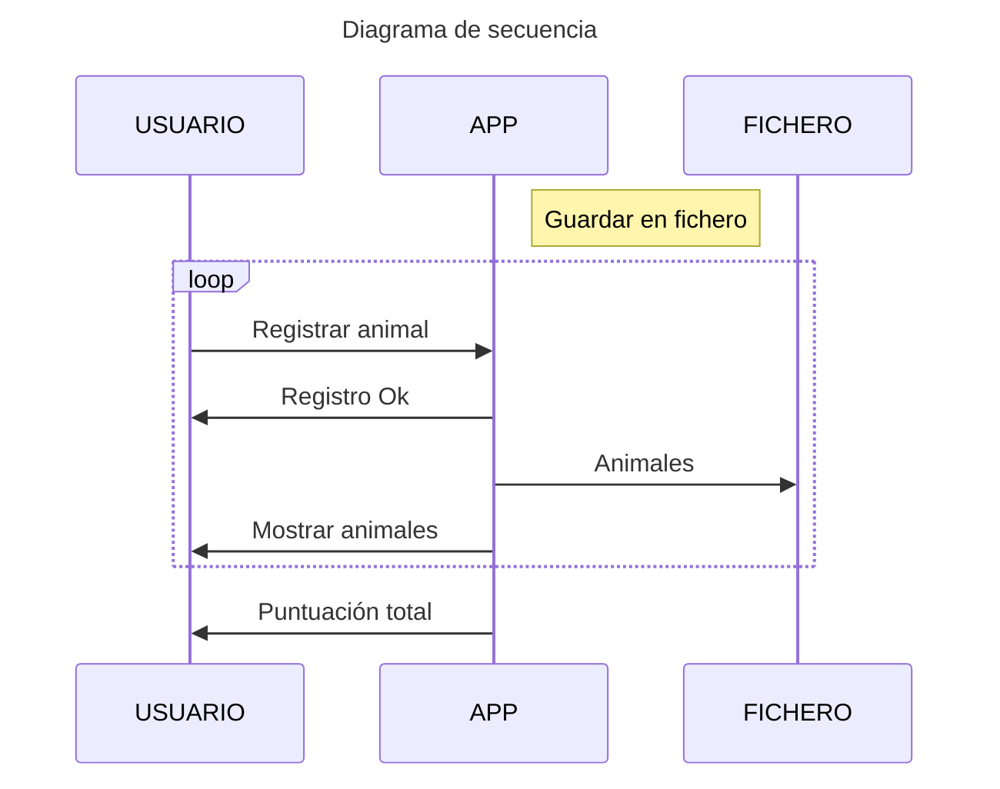
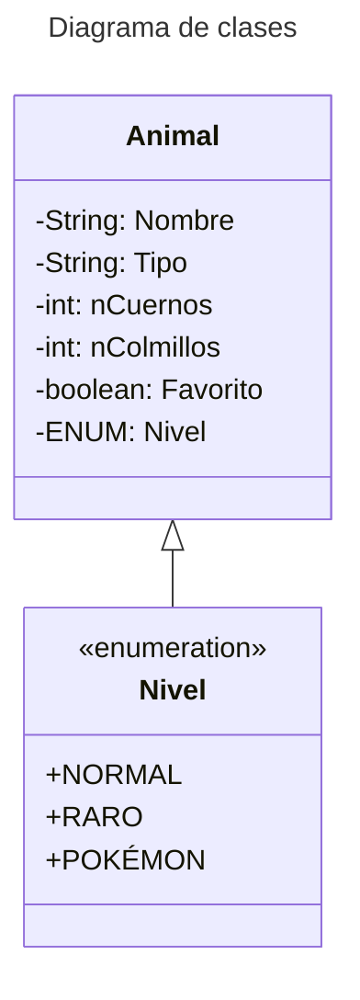

## ZOOPEDIA

```mermaid
---
title: Diagrama de secuencia 
---
sequenceDiagram

    participant U as USUARIO
    participant A as APP
    Note right of A: Guardar en fichero
    participant F as FICHERO
    
    loop
    U->>A: Registrar animal
    A->>U: Registro Ok
    A->>F: Animales
    A->>U: Mostrar animales
    end

    A->>U: Puntuación total
```
   

```mermaid
---
title: Diagrama de clases
---

classDiagram
    class Animal{
        -String: Nombre
        -String: Tipo
        -int: nCuernos
        -int: nColmillos
        -boolean: Favorito
        -ENUM: Nivel
    }

    class Nivel{
        <<enumeration>>
        +NORMAL
        +RARO
        +POKÉMON
    }

    Animal<|--Nivel

```