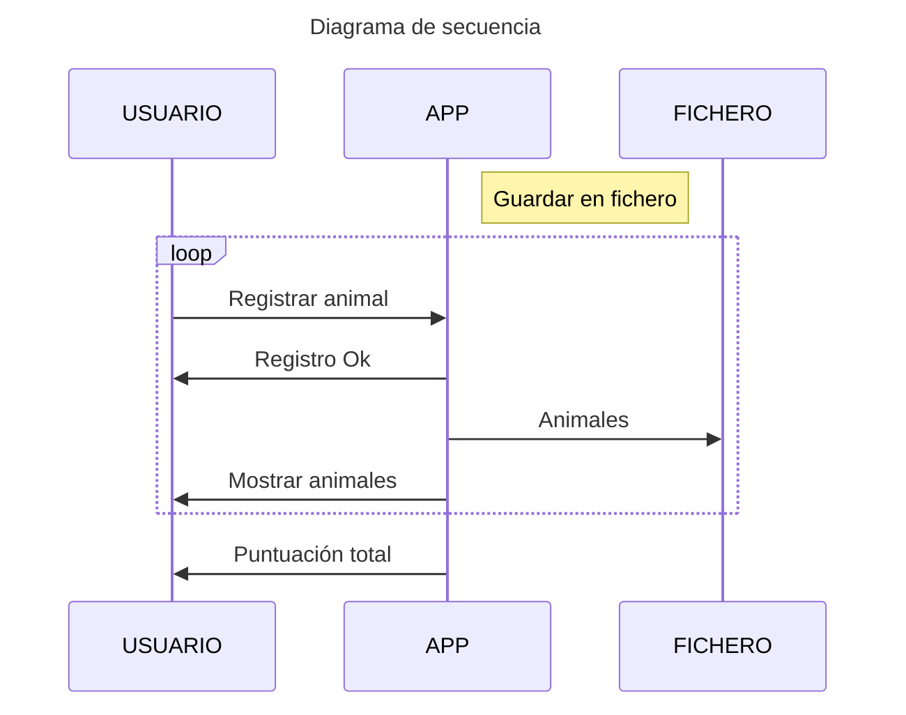
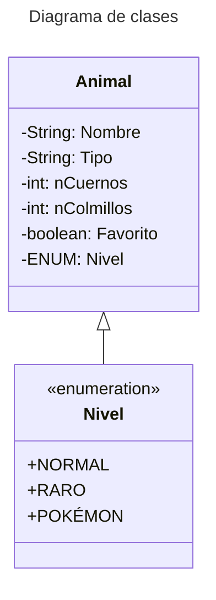

## ZOOPEDIA

   

## Explicaciones de código
Clase Animal, en esta clase el constructor solicita SOLO la información necesaria para el animal, el resto de atributos se controlan con la lógica aplicada. Por ejemplo, en base a los atributos nCol y nCuer se establece el "nivel" del animal.
 
El nivel del animal esta en su constructor, este llama a un método que lo establece con return. Cabe recordar que determinados atributos del animal son ENUM.
